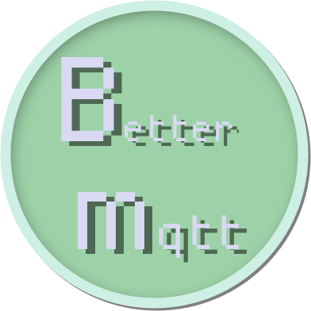

# betterMQTT
#### 为什么写这个
MQTT协议在现在的物联网项目中占有很大地位，但现在可视化MQTT客户端并没有完美的，所以想自己整一个

#### 介绍
打造一个相对完美的MQTT客户端

#### 软件架构
采用Python的[Dear PyGui框架](https://github.com/hoffstadt/DearPyGui) 作为GUI框架

#### 开发进程
1、第一个大版本实现嗅探模式
2、第二个版本实现基本的数据分析功能

#### 安装教程
1. 还没写完
2. 

#### 使用说明
1. 还没写完
2. 

#### 如何参与
pip install -r requirements.txt